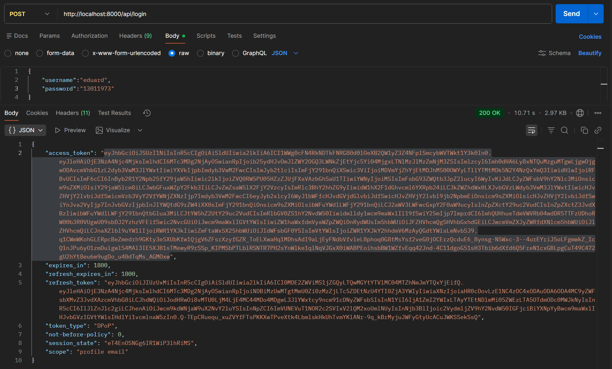
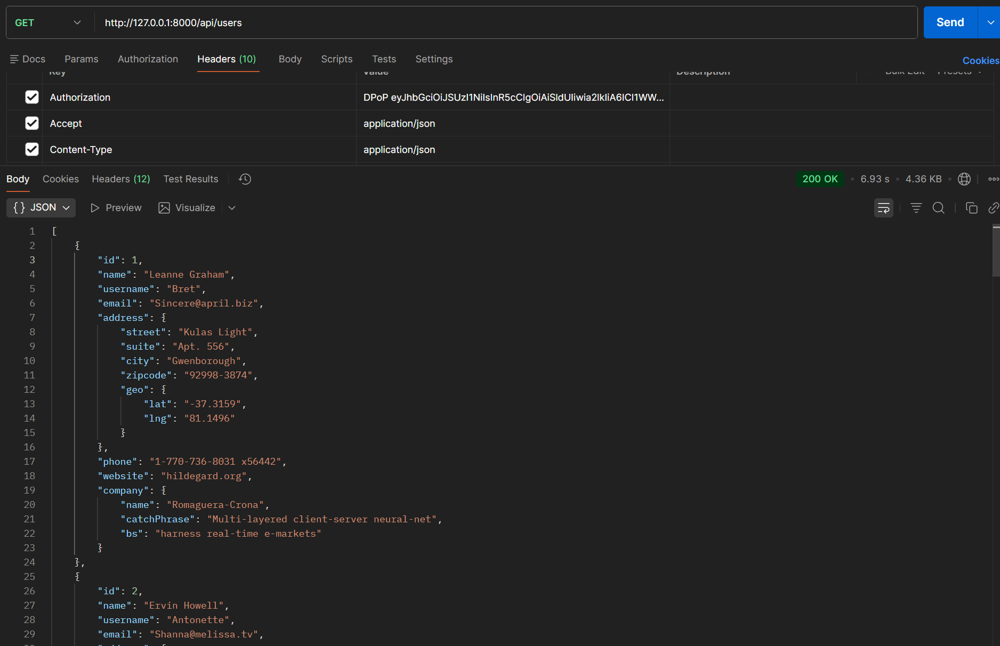
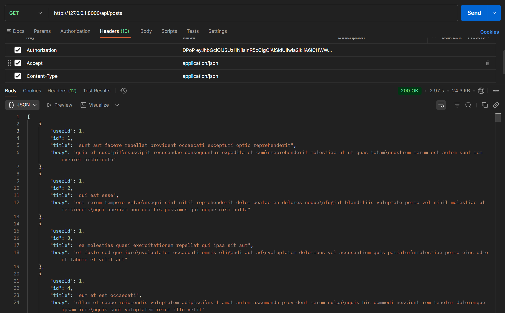

Se implementa un API Gateway que enruta peticiones HTTP y protege endpoints mediante autenticación con (JWT).

|Endpoint de Entrada|¿Requiere Token?|Acción                                   |
|POST /api/login	|   ❌ No       |Genera un Token en base a credenciales    |
|GET /api/users	    |   ✅ Sí       |https://jsonplaceholder.typicode.com/users|
|GET /api/posts	    |   ✅ Sí       |https://jsonplaceholder.typicode.com/posts|
🔐 Autenticación

El proyecto utiliza Keycloak para la generación y validación de tokens JWT (DPoP Token).
Aunque el entorno Docker incluye configuración de base de datos, para esta actividad no es necesaria una base de datos, ya que:

La autenticación se realiza mediante Keycloak.
Los datos consumidos provienen del servicio externo público JSONPlaceholder.

👤 Credenciales de Prueba
Utilizar las siguientes credenciales para generar el token:

{
  "username": "eduard",
  "password": "13011973"
}

🚀 Ejecución del Proyecto
1️⃣ Levantar con Docker

docker compose up --build -d

2️⃣ Acceso a la API
La API estará disponible en:

http://localhost:8000

🧪 Pruebas de Funcionamiento
🔑 1. Generación de Token
POST /api/login

Este endpoint no requiere autenticación y devuelve un DPoP  Token válido.

Ejemplo de request:

curl -X POST http://localhost:8000/api/login \
  -H "Content-Type: application/json" \
  -d '{"username":"eduard","password":"13011973"}'

📸 Evidencia:

👥 2. Endpoint Protegido – Usuarios
GET /api/users

Requiere header:

Authorization: DPoP  <token>

Redirige correctamente a:

https://jsonplaceholder.typicode.com/users

Ejemplo:

curl -X GET http://localhost:8000/api/users \
  -H "Authorization: DPoP  <token>"

📸 Evidencia:

📝 3. Endpoint Protegido – Posts
GET /api/posts

Requiere header:

Authorization: DPoP  <token>

Redirige correctamente a:

https://jsonplaceholder.typicode.com/posts

Ejemplo:

curl -X GET http://localhost:8000/api/posts \
  -H "Authorization: DPoP  <token>"

📸 Evidencia:

🏗 Estructura Relevante del Proyecto
Middleware de validación JWT
app/Presentation/Http/Middleware/KeycloakJwtMiddleware.php

Definición de rutas protegidas
app/Presentation/Routes/api.php

Controlador Proxy (API Gateway)
app/Presentation/Http/Controllers/ProxyController.php

Controlador de Login
app/Presentation/Http/Controllers/LoginController.php

🐳 Contenedores Docker

El proyecto incluye:

Dockerfile

docker-compose.yml

Lo que permite ejecutar la solución directamente mediante:

docker compose up --build -d

No requiere configuración adicional.

📦 Repositorio

URL del repositorio:

https://github.com/Eduardito187/microservicio-produccion-cocina
